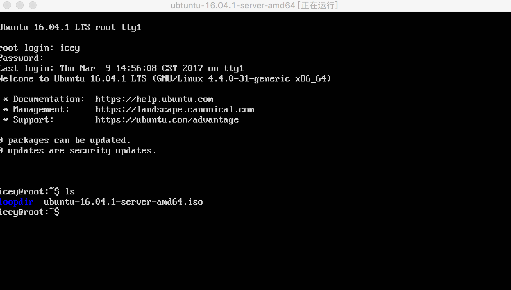
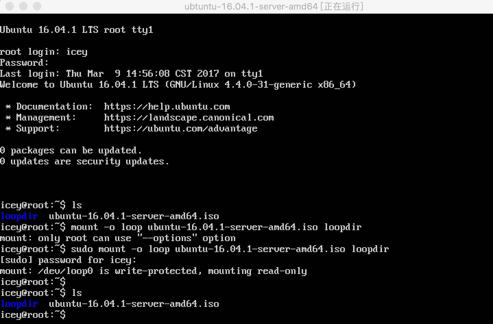
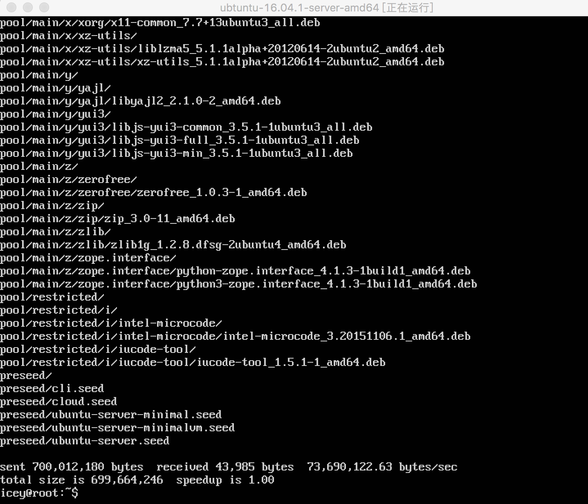
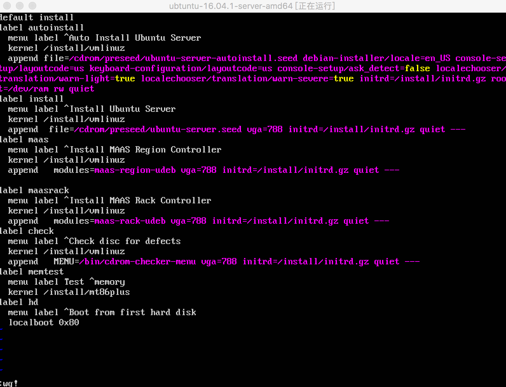
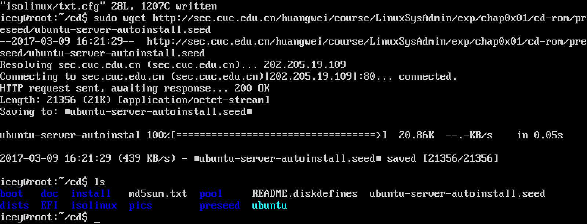
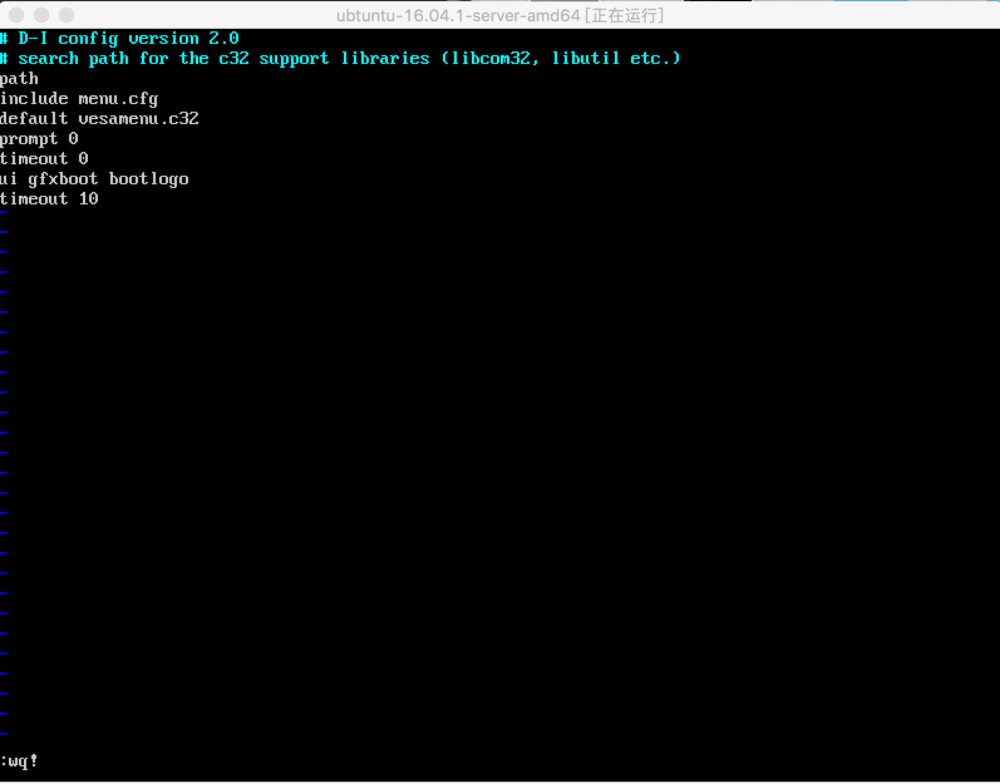
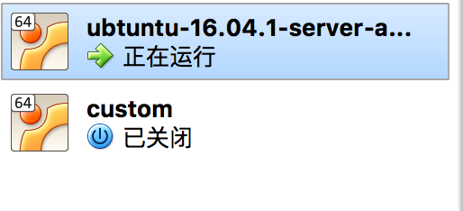

#Lab1 无人值守ISO安装制作实验报告
##一 实验内容    
**目的：**    
1.学习操作系统安装，配置无人值守安装iso并在Virtualbox中完成自动化安装    
2.Virtualbox安装完Ubuntu之后新添加的网卡实现系统开机自动启用和自动获取IP    
3.使用sftp在虚拟机和宿主机之间传输文件    
**要求：**    
1.定制用户名和默认密码    
2.定制安装OpenSSH Server    
3.安装过程禁止自动联网更新软件包

##二 实验环境    
###虚拟机：下载安装Ubuntu-16.04.1镜像



##三 实验步骤     
**1.在当前用户目录下创建一个用于挂载iso镜像文件的目录:**    

mkdir loopdir

**2.挂载iso镜像文件到该目录:**    

mount -o loop ubuntu-16.04.1-server-amd64.iso loopdir

**3.创建一个工作目录用于克隆光盘内容:**

mkdir cd



**4.同步光盘内容到目标工作目录**

rsync -av loopdir/ cd



**5.卸载iso镜像:**

umount loopdir


**6.进入目标工作目录:**

cd cd/


**7.编辑Ubuntu安装引导界面增加一个新菜单项入口:**    

vim isolinux/txt.cfg

**8.添加以下内容到该文件后强制保存退出:**

```
label autoinstall
  menu label ^Auto Install Ubuntu Server
  kernel /install/vmlinuz
  append  file=/cdrom/preseed/ubuntu-server-autoinstall.seed debian-installer/locale=en_US console-setup/layoutcode=us keyboard-configuration/layoutcode=us console-setup/ask_detect=false localechooser/translation/warn-light=true localechooser/translation/warn-severe=true initrd=/install/initrd.gz root=/dev/ram rw quiet
```



**9.提前阅读并编辑定制Ubuntu官方提供的示例preseed.cfg，并将该文件保存到刚才创建的工作目录:  ~/cd/preseed/ubuntu-server-autoinstall.seed**



**10.修改isolinux/isolinux.cfg，增加内容timeout 10（可选，否则需要手动按下ENTER启动安装界面:**



**11.从host登陆虚拟机并完成操作**

```
# 重新生成md5sum.txt
cd ~/cd && find . -type f -print0 | xargs -0 md5sum > md5sum.txt

# 封闭改动后的目录到.iso
IMAGE=custom.iso
BUILD=~/cd/

mkisofs -r -V "Custom Ubuntu Install CD" \
            -cache-inodes \
            -J -l -b isolinux/isolinux.bin \
            -c isolinux/boot.cat -no-emul-boot \
            -boot-load-size 4 -boot-info-table \
            -o $IMAGE $BUILD
# 如果目标磁盘之前有数据，则在安装过程中会在分区检测环节出现人机交互对话框需要人工选择
```


**12.导出镜像**

##下载Custom.iso    

**新建虚拟机并完成安装**



