# 实验五 WEB服务器搭建    

## 实验环境  
* Ubuntu16.04 desktop    
    * nginx
    * verynginx  
* Ubuntu16.04 desktop
    * wordpress   
* Ubuntu16.04 desktop 
    * dvwa    
        
## 实验步骤   
   
* 安装VeryNginx  

1.先安装git-man liberror-perl  
`sudo apt-get install git-man liberror-perl`  
  
2.克隆VeryNginx仓库到本地  
`git clone https://github.com/alexazhou/VeryNginx.git`  

3.安装libpcre3-dev、libssl-dev和build-essential  
`sudo apt-get install build-essential libssl-dev libpcre3-dev`  

4.一键安装 VeryNginx 和 以及依赖的 OpenResty  
`python install.py install`
【注意】要cd转到VeryNginx目录下，并用sudo安装  

5.将/opt/verynginx/openresty/nginx/conf/nginx.conf文件下的user nginx修改为user www-data  

6.启动服务
`sudo /opt/verynginx/openresty/nginx/sbin/nginx`  

* 搭建成功  

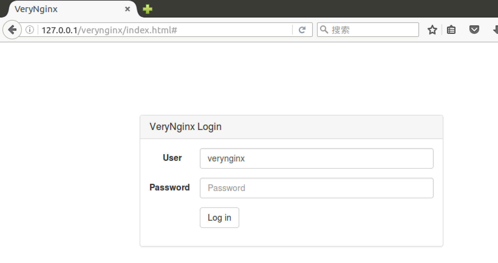

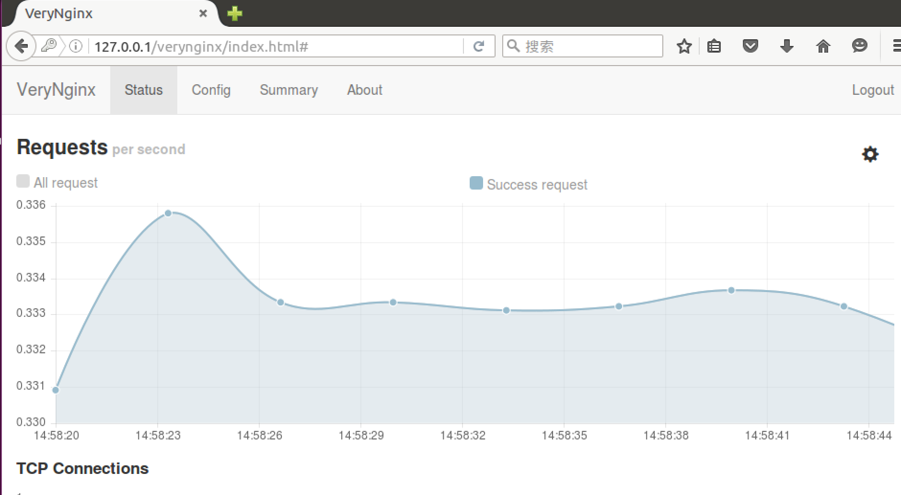

 
详细过程参照 [VeryNginx安装配置](https://github.com/alexazhou/VeryNginx/blob/master/readme_zh.md)
故障排除参照 [VeryNginx故障排除](https://github.com/alexazhou/VeryNginx/wiki/Trouble-Shooting)  

  
* 安装WordPress  

1.在安装WordPress之前需要先安装Nginx，MySQL，PHP（LEMP）  
[LEMP配置教程](https://www.digitalocean.com/community/tutorials/how-to-install-linux-nginx-mysql-php-lemp-stack-in-ubuntu-16-04)  

2.WordPress HTTPS搭建，创建自签发SSL证书
[创建自签发SSL证书](https://www.digitalocean.com/community/tutorials/how-to-create-a-self-signed-ssl-certificate-for-nginx-in-ubuntu-16-04)  

3.配置服务器／etc／hosts文件  
为了使Wordpress搭建的站点对外提供访问的地址为： https://wp.sec.cuc.edu.cn 和 http://wp.sec.cuc.edu.cn ，需要构建IP和相应域名的映射关系。

4.WordPress安装配置  

[WordPress安装配置](https://www.digitalocean.com/community/tutorials/how-to-install-wordpress-with-lemp-on-ubuntu-16-04)
       
5.搭建成功  

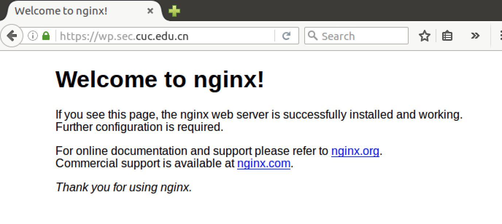

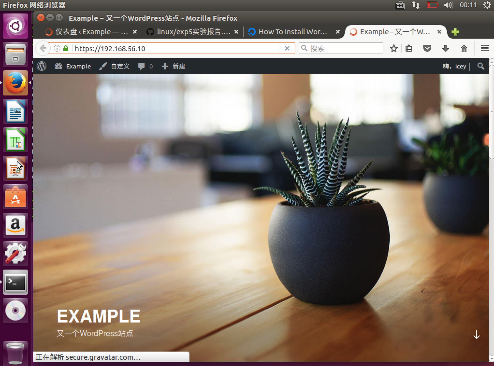

* DVWA  

1.安装  

[DVWA指导手册](https://www.youtube.com/watch?v=1C51jmFRXKw)  

2.配置 /etc/php/7.0/fpm/php.ini ，将allow_url_include=Off改为allow_url_include=On  

3.配置 /var/www/html/DVWA-master/config/config.ini.php.dist ，
将config.inc.php.dist复制成config.inc.php  

4.成功    

未修改配置/etc/php/7.0/fpm/php.ini之前  

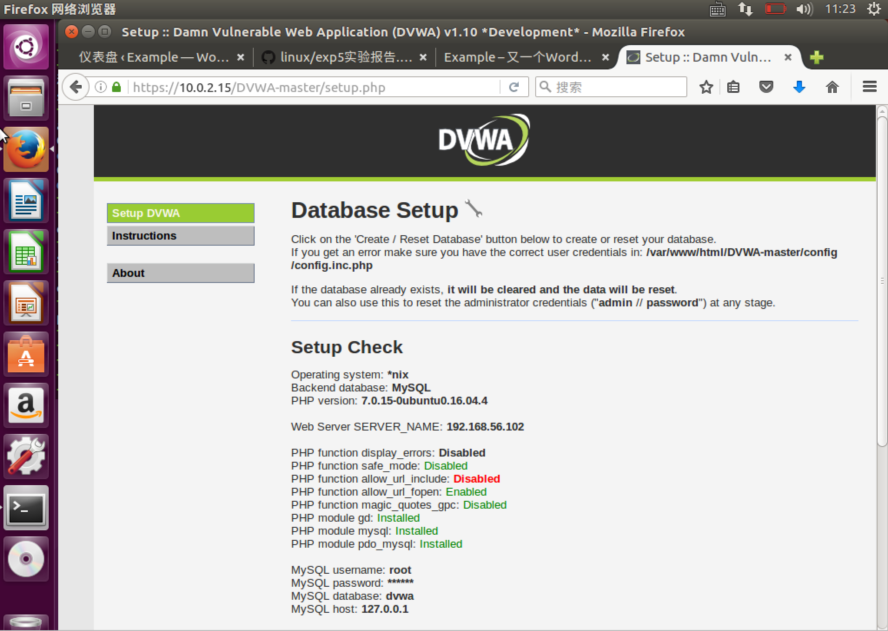

修改之后  

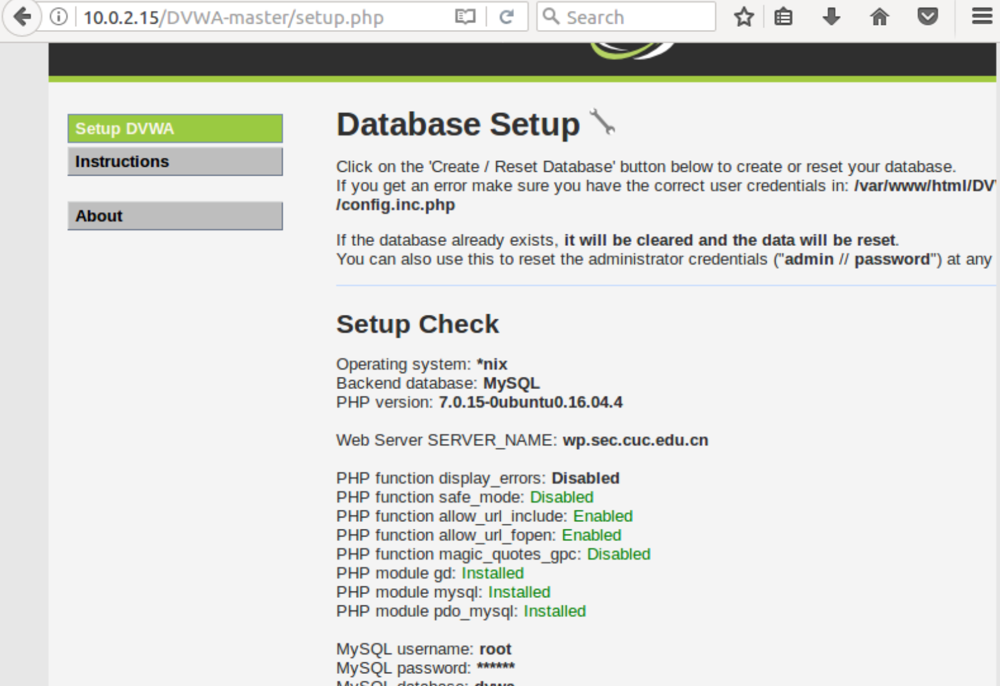
  
  
## 实验要求    
### 基本要求     
  
1.在一台主机（虚拟机）上同时配置Nginx和VeryNginx  
  
* VeryNginx作为本次实验的Web App的反向代理服务器和WAF    
  
* Up Stream，Proxy Pass  

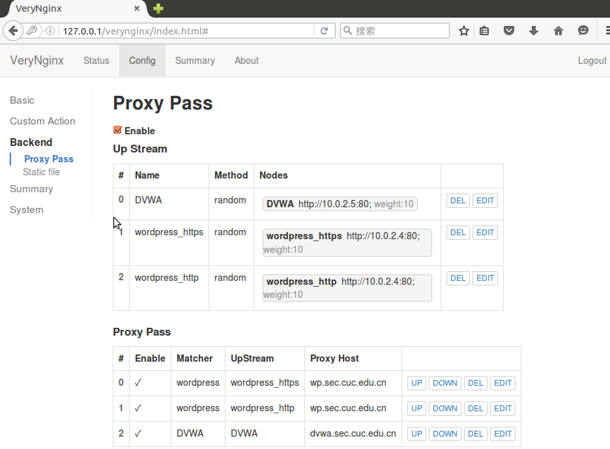  
  
  * Matcher  

  

  
  * 配置hosts文件  
    
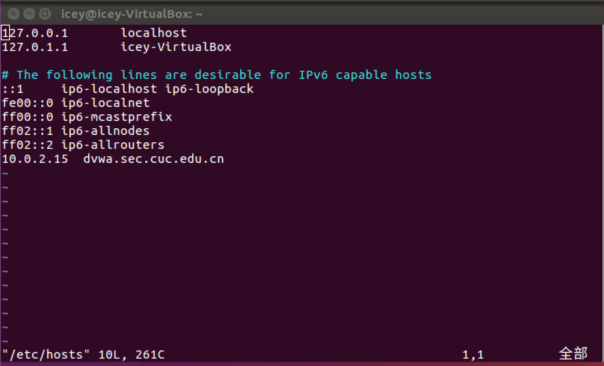

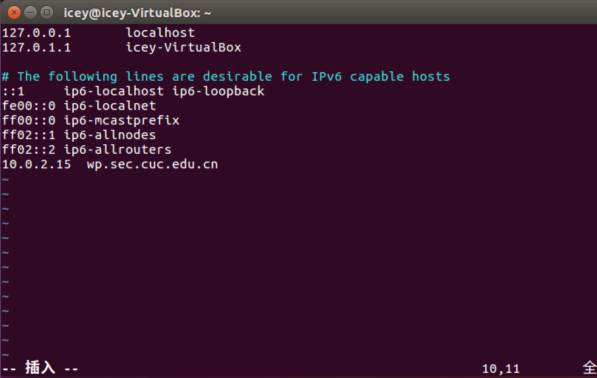

2.使用Wordpress搭建的站点对外提供访问的地址为：    
   https://wp.sec.cuc.edu.cn 和 http://wp.sec.cuc.edu.cn  
   
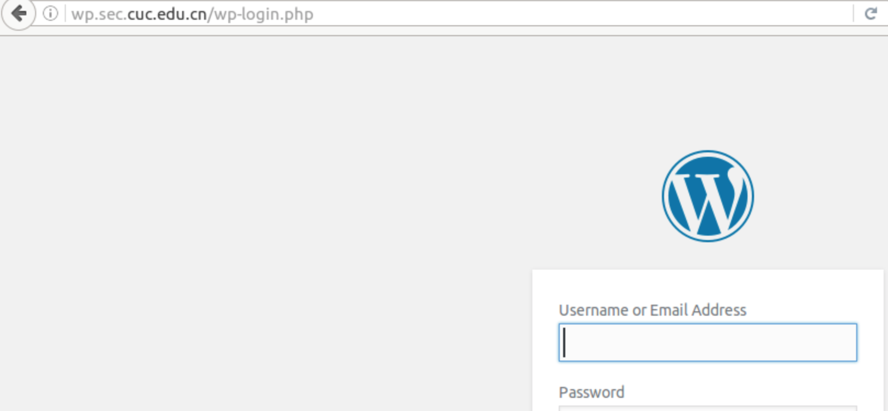

3.使用Damn Vulnerable Web Application (DVWA)搭建的站点对外提供访问的地址为： http://dvwa.sec.cuc.edu.cn  

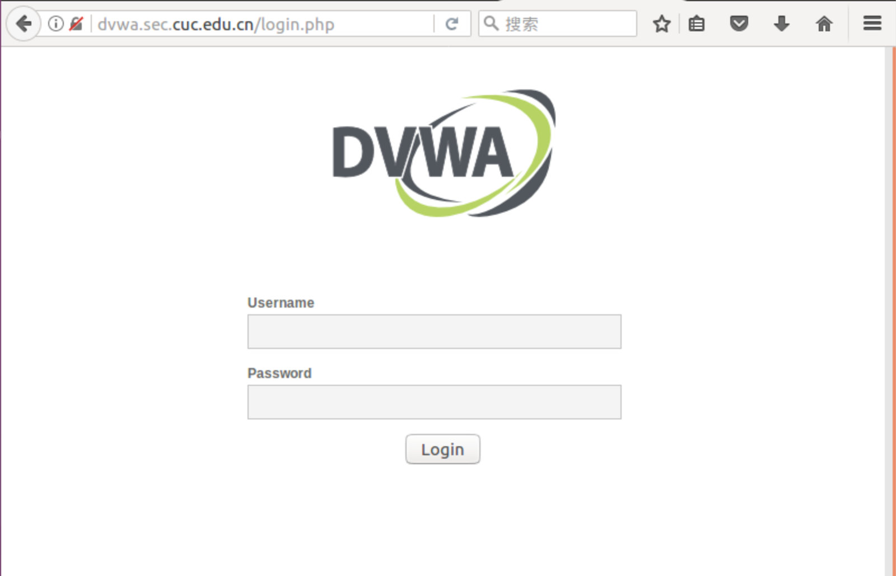

### 安全加固要求
1.使用IP地址方式均无法访问上述任意站点，并向访客展示自定义的友好错误提示信息页面-1      
  
  * Matcher  

  * Response  

  * Filter  
  

* 结果  

2.Damn Vulnerable Web Application (DVWA)只允许白名单上的访客来源IP，其他来源的IP访问均向访客展示自定义的友好错误提示信息页面-2  
  
  * Matcher
  

  * Response  

  * Filter  
  

  
* 结果  

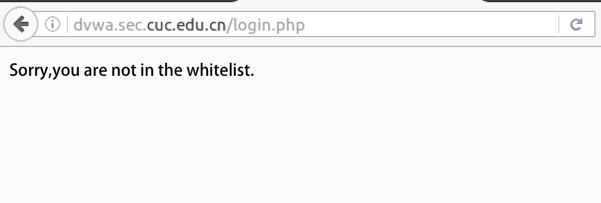

3.在不升级Wordpress版本的情况下，通过定制VeryNginx的访问控制策略规则，热修复WordPress < 4.7.1 - Username Enumeration
  
原理：访问/wp-json/wp/v2/users/可以获取wordpress用户信息的json数据，所以采用的方法是禁止访问站点的/wp-json/wp/v2/users/路径  
 
  * Matcher  
  
  

  * Filter  

  

4.通过配置VeryNginx的Filter规则实现对Damn Vulnerable Web Application (DVWA)的SQL注入实验在低安全等级条件下进行防护       
  
  * 先把DVWA安全保护级别改为低  

  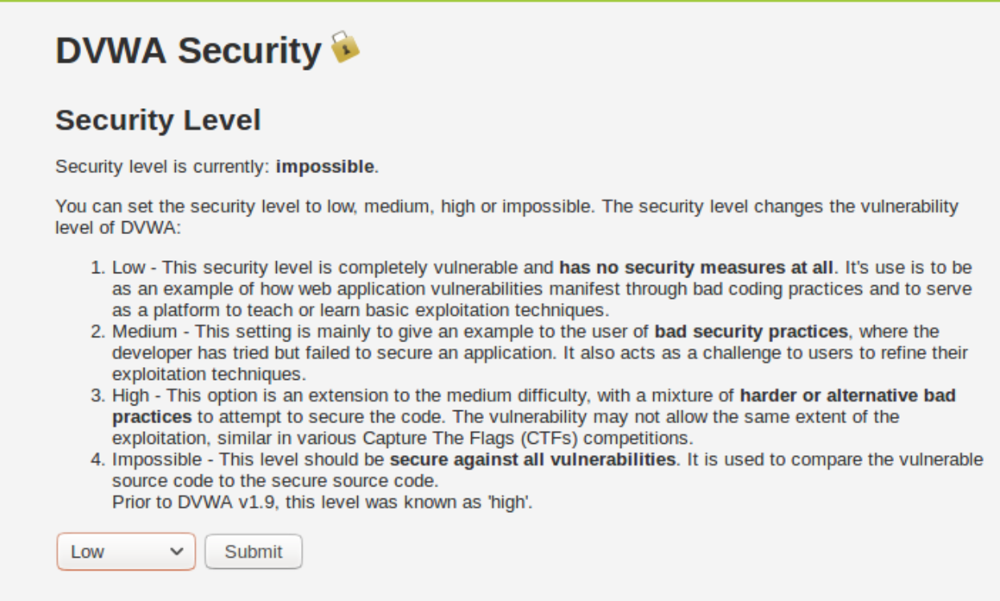
  
  * 配置VeryNginx  

  

### VERYNGINX配置要求
1.VeryNginx的Web管理页面仅允许白名单上的访客来源IP，其他来源的IP访问均向访客展示自定义的友好错误提示信息页面-3
2.通过定制VeryNginx的访问控制策略规则实现：
* 限制DVWA站点的单IP访问速率为每秒请求数 < 50
* 限制Wordpress站点的单IP访问速率为每秒请求数 < 20
* 超过访问频率限制的请求直接返回自定义错误提示信息页面-4
* 禁止curl访问

## 实验中遇到的问题  

* 先是使用Ubuntu server，在本机打不开Nginx的页面，还遇到各种各样bug。
* 后来安装两台ubuntu desktop，分别搭建VeryNginx和WordPress、DVWA，在WordPress和DVWA互相访问时又出现bug，听从大神们的意见后，安装了三台ubuntu，分别搭建VeryNginx、WordPress和DVWA。
* 在启动VeryNginx时，总是显示80端口被占用，后来采用先停止服务，然后再次启动服务成功，或者使用sudo fuser -k 80/tcp，杀死80端口的所有进程，同样可以成功启动。
* 中途遇到bug的时候，重启虚拟机，发现重启之后IP地址会变，之前没有发现，后来都手动更改IP地址。
* 在安装WordPress的过程中，进行完之前的一系列操作之后，无法打开安装页面，后来重新顺了一遍，发现时中间修改的配置文件没有被保存。
* 在访问WordPress时，不知道为什么地址总是自动跳转成192.168.56.10，问了安莹小姐姐，她之前也遇到过这个问题，说是WordPress会记住第一次访问的地址，所以才会出现跳转，在她的帮助下修改数据库得到解决。

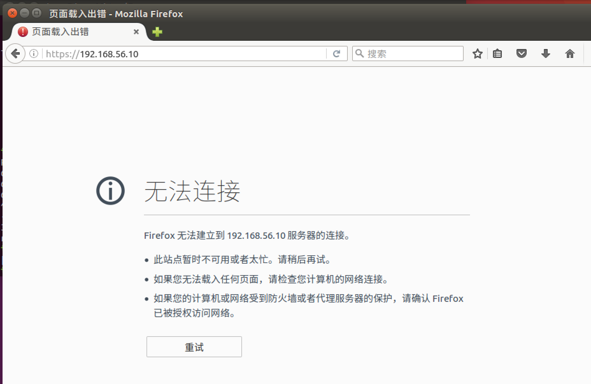
  
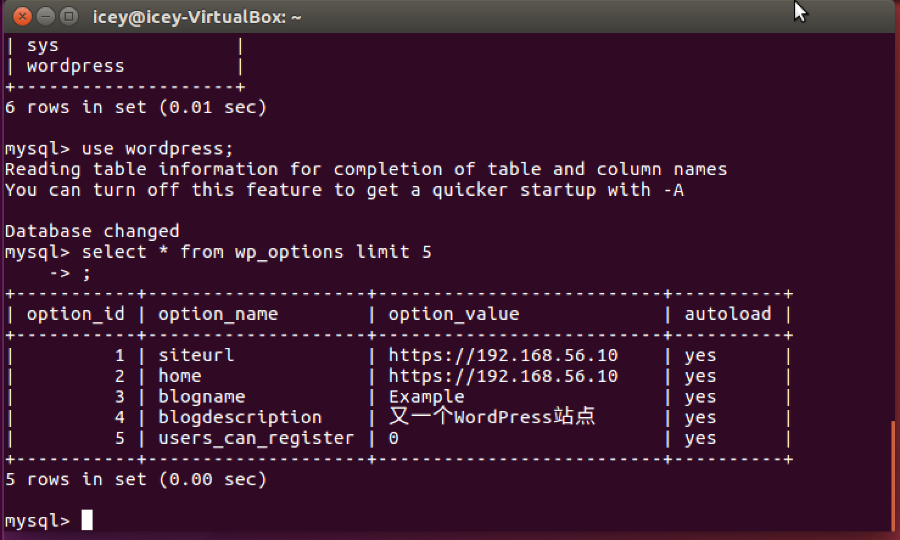
  
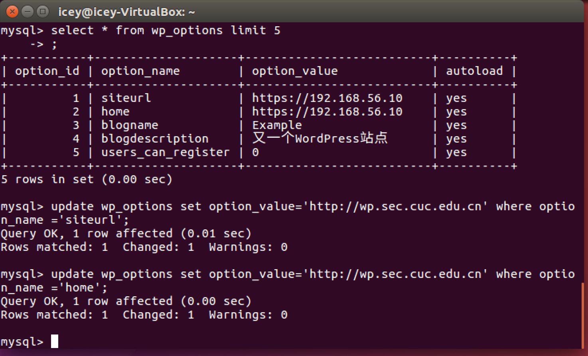

* 整个实验过程中，还遇到很多很多很多的小问题，在请教各位大神的过程中得到解决。很多时候，明明执行的命令都能成功，最终就是打不开，或者出现很多莫名其妙的问题，实验环境的搭建真的耗尽心力，一度想要放弃。不过最终在努力下还是成功搭建，也让我恢复了信心，完成之后的实验任务。
* 本次实验主要参考的实验报告如下：  
  [赵嘉懿实验5报告](https://github.com/Zhaojytt/linux/blob/master/2017-1/zjy/exp5/exp5实验报告.md)
  [陈安莹实验5报告](https://github.com/CUCCS/linux/blob/master/2017-1/cay/ex5/实验报告5.md)
  [罗慧玉实验5报告](https://github.com/CUCCS/linux/blob/master/2017-1/lhy/task5/搭建webserver.md)
  [陶泽威实验5报告](https://github.com/CUCCS/linux/blob/master/2017-1/tzw/chapter5/web搭建实验报告.md)
  非常感谢各位同学！  
  
  
##   参考链接  

[VeryNginx安装配置文档](https://github.com/alexazhou/VeryNginx/blob/master/readme_zh.md)  
[VeryNginx故障排除文档](https://github.com/alexazhou/VeryNginx/wiki/Trouble-Shooting)  
[LEMP安装配置](https://www.digitalocean.com/community/tutorials/how-to-install-linux-nginx-mysql-php-lemp-stack-in-ubuntu-16-04)  
[创建自签发SSL证书](https://www.digitalocean.com/community/tutorials/how-to-create-a-self-signed-ssl-certificate-for-nginx-in-ubuntu-16-04)  
[WordPress安装配置](https://www.digitalocean.com/community/tutorials/how-to-install-wordpress-with-lemp-on-ubuntu-16-04)
[DVWA指导手册](https://www.youtube.com/watch?v=1C51jmFRXKw)

