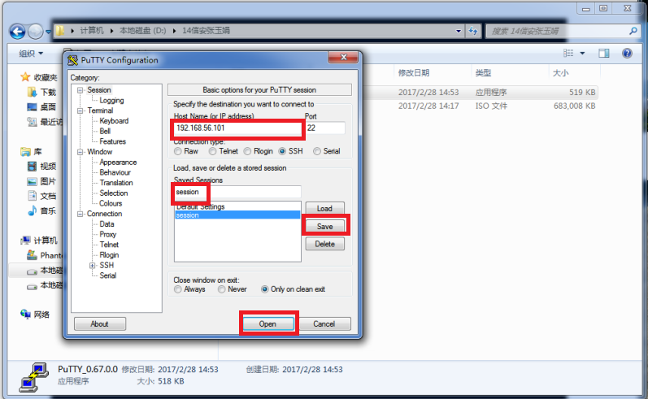
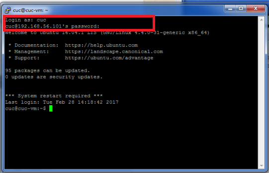
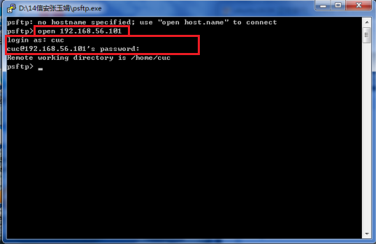
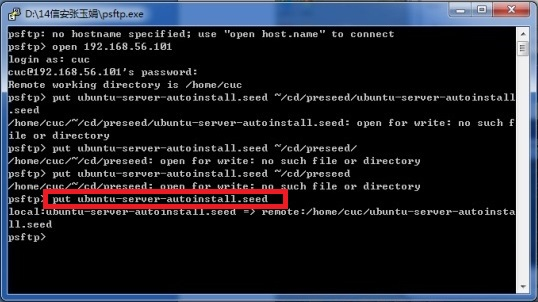
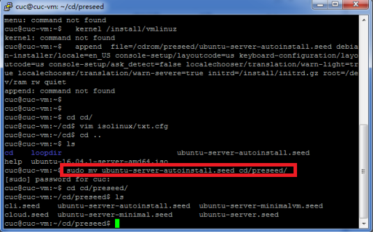
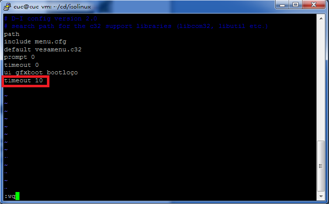
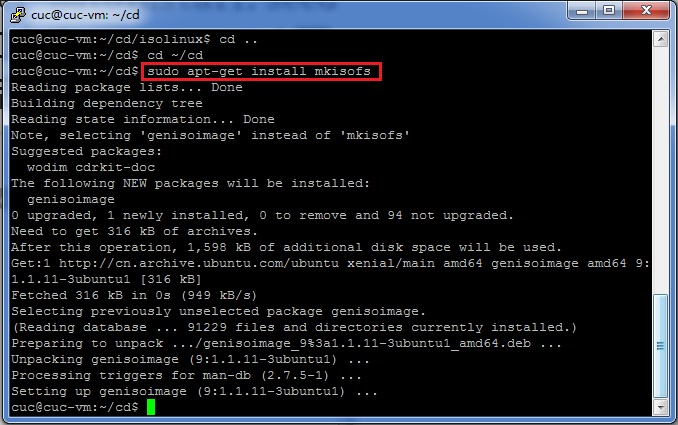
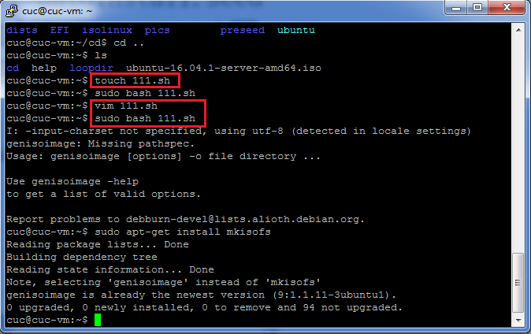
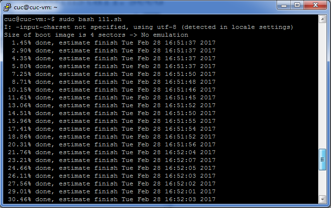
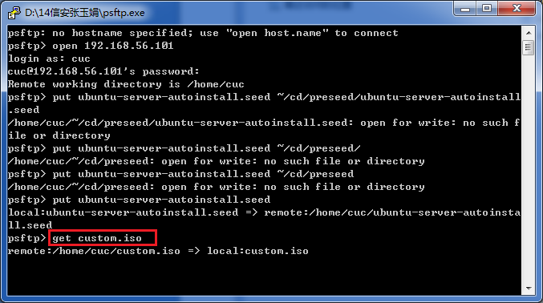

#实验一：无人值守Linux安装镜像制作

----------
##一、实验内容
无人值守安装，指的是安装时无需任何用户干预，直接按默认设置安装  

1.学习操作系统安装，配置无人值守安装iso并在Virtualbox中完成自动化安装 
 
2.Virtualbox安装完Ubuntu之后新添加的网卡实现系统开机自动启用和自动获取IP  

3.使用sftp在虚拟机和宿主机之间传输文件

##二、实验环境
#####ubuntu-16.04.1-server-amd64
##三、实验工具
**1.PuTTY**  
PuTTY是远程登录工具。支持SSH1和SSH2。

**2.PSFTP**  
PSFTP是PuTTY SFTP客户端，用于本地与服务器间安全传输文件（使用SSH连接）。

##四、实验过程

#####1.将虚拟机中ubuntu-16.04.1-server 网卡模式设置为：**NAT和Host-Only**双网卡模1式。  

**NAT**：网络地址转换(Network Address Translation)的简称，通常用于Internet接入。

**Host-only**：这种技术提供了主机和虚拟机、虚拟机和虚拟机之前的网络通信，而不是虚拟机访问Internet，在这种模式下相当于使虚拟机和主机、虚拟机和虚拟机处在一个和外网隔离的网络中。

#####2..配置网卡
因为设置的是双网卡，还需新添加一个网卡并动态分配地址  
`sudo dhclient enp0s8`  

> 1.  dhclient命令使用动态主机配置协议动态的配置网络接口的网络参数。   
> 2.  sudo是linux系统管理指令，是允许系统管理员让普通用户执行一些或者全部的root命令的一个工具

新分配地址为：192.168.56.101 
 
#####3..打开PuTTY和PSTFP
目标IP地址为刚才动态分配地址：192.168.56.101  
新建session并保存打开  
  

  

打开PSTFP使用`open IP`方式连接    

> 这样就可以使用剪贴板

#####4.在虚拟机中登录
下载镜像
`wget https://sec.cuc.edu.cn/ftp/iso/ubuntu-16.04.1-server-amd64.iso`

在当前用户目录下创建一个用于挂载iso镜像文件的目录  
`mkdir loopdir`

挂载iso镜像文件到该目录  
`mount -o loop ubuntu-16.04.1-server-amd64.iso loopdir`

创建一个工作目录用于克隆光盘内容  
`mkdir cd`

同步光盘内容到目标工作目录
一定要注意loopdir后的这个/，cd后面不能有/  
`rsync -av loopdir/ cd`

卸载iso镜像  
`umount loopdir`

进入目标工作目录  
`cd cd/`

编辑Ubuntu安装引导界面增加一个新菜单项入口  
`vim isolinux/txt.cfg</pre>`

    添加以下内容到该文件后强制保存退出  
     label autoinstall  
     menu label ^auto install ubuntu server  
     kernel /install/vmlinuz  
     append  file=/cdrom/preseed/ubuntu-server-autoinstall.seed debian-installer/locale=en_us console-setup/layoutcode=us keyboard-configuration/layoutcode=us console-setup/ask_detect=false localechooser/translation/warn-light=true localechooser/translation/warn-severe=true initrd=/install/initrd.gz root=/dev/ram rw quiet
> 复制到default install 下面
保存方式：按Esc后 输入**:wq** 或者 **:x**

#####5.下载修改定制好的ubuntu-server-autoinstall.seed ，并将该文件保存到刚才创建的工作目录~/cd/preseed/ubuntu-server-autoinstall.seed
使用PSFTP下载  
`put ubuntu-server-autoinstall.seed`  
  
移动位置到该目录
`sudo mv ubuntu-server-autoinstall.seed cd/preseed`

#####6.修改isolinux/isolinux.cfg，增加内容timeout 10  
进入isolinux目录下` vim isolinux.cfg`

#####7.生成新镜像
重新生成md5sum.txt
    cd ~/cd && find . -type f -print0 | xargs -0 md5sum > md5sum.txt
    
    # 封闭改动后的目录到.iso
    IMAGE=custom.iso
    # 路径要写成绝对路径，不然会出错
    BUILD=/home/cuc/cd/
    
    mkisofs -r -V "Custom Ubuntu Install CD" \
    -cache-inodes \
    -J -l -b isolinux/isolinux.bin \
    -c isolinux/boot.cat -no-emul-boot \
    -boot-load-size 4 -boot-info-table \
    -o $IMAGE $BUILD
>chmod  改变文件的读写许可设置，  
>语法为:chmod abc file  
>其中a,b,c各为一个数字，分别表示User、Group、及Other的权限。   
>r=4，w=2，x=1

`sudo chmod 777 md5sum.txt `  
先给文件提权，再重新生成，否则没有权限
`sudo find . -type f -print0 | xargs -0 md5sum > md5sum.txt`

安装mkisofs  
`sudo apt-get install mkisofs`
   
使用touch命令创建一个111.sh文件    
`touch 111.sh`  
`vim 111.sh`  
`sudo bash 111.sh`

封闭改动后的目录到.iso  
>     		IMAGE=custom.iso  
>     		BUILD=~/cd/  
>     			mkisofs -r -V "Custom Ubuntu Install CD" \
>     		-cache-inodes \
>     		-J -l -b isolinux/isolinux.bin \
>     		-c isolinux/boot.cat -no-emul-boot \
>     		-boot-load-size 4 -boot-info-table \
>     		-o $IMAGE $BUILD     
		

#####8. 从PSFTP中拷出新镜像 

#####9. 在虚拟机中新建Linux Ubuntu 64bit ，选中本地我们新生成的镜像，启动。  
