# 实验1 配置无人值守安装iso并在Virtualbox中完成自动化安装

## 实验问题

1. 如何配置无人值守安装iso并在Virtualbox中完成自动化安装。
2. Virtualbox安装完Ubuntu之后新添加的网卡如何实现系统开机自动启用和自动获取IP？
3. 如何使用sftp在虚拟机和宿主机之间传输文件？

## 实验环境

镜像 ubuntu-16.04.2-server-amd64.iso  

网络连接方式 NAT+Host-Only

> It is best if the machine running in VirtualBox is in its own virtual network, so that I can both: 

> * Use SSH to access the Linux virtual machine from Windows 
> * Have the Virtual machine run regardless of the network the host computer is in. 
> * If the host computer has Internet, the virtual machine should also have Internet connectivity.   

> To do this in Virtual Box, the machine needs to have two network adapters enabled: 

> * A NAT adapter to give the virtual machine Internet access 
> * A host-only adapter to allow SSH access from PuTTY on the Windows host. 

配置过程详见problem 1。

* [VirtualBox’s host-only adapter](http://samiam.org/blog/20130826.html)

## 实验过程

1. 在 PuTTY 的CLI中进行操作, 方便命令的复制粘贴。 同时使用psftp中的put和get命令完成宿主机和虚拟机之间的文件传输。

	  

	
 
2. server版的ubuntu如何从命令行挂载Virtualbox的虚拟光驱中镜像？

        # 在当前用户目录下创建一个用于挂载iso镜像文件的目录
    	mkdir loopdir
		
		# server版的ubuntu如何从命令行挂载Virtualbox的虚拟光驱中镜像？
		# Solution: 挂载iso镜像文件到该目录
		mount -o loop ubuntu-16.04.2-server-amd64.iso loopdir
	
3. 克隆光盘

		# 创建一个工作目录用于克隆光盘内容
		mkdir cd
	 
		# 同步光盘内容到目标工作目录
		rsync -av loopdir/ cd
		

4. 将交互步骤写入配置文件，重新打包iso
  

		# 卸载iso镜像
		umount loopdir
				
		# 进入目标工作目录
		cd cd/
				
		# 编辑Ubuntu安装引导界面增加一个新菜单项入口
		vim isolinux/txt.cfg

	修改后如图所示：

	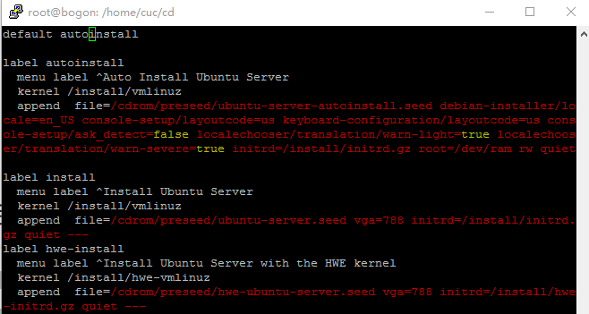

		# 将定制的seed文件保存到~/cd/preseed/

		# 修改isolinux/isolinux.cfg，增加内容timeout 10
		
		# 重新生成md5sum.txt
		find . -type f -print0 | xargs -0 md5sum > /home/cuc/md5sum.txt
		
		# 封闭改动后的目录到.iso
		IMAGE=custom.iso
		BUILD=~/cd/
		
		mkisofs -r -V "Custom Ubuntu Install CD" \
		            -cache-inodes \
		            -J -l -b isolinux/isolinux.bin \
		            -c isolinux/boot.cat -no-emul-boot \
		            -boot-load-size 4 -boot-info-table \
		            -o $IMAGE $BUILD
	
	

	生成custom.iso，传入宿主机。
	
	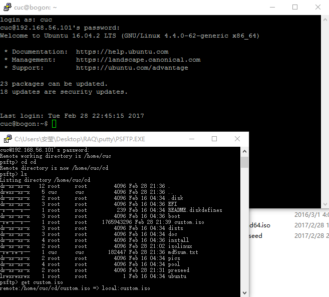

5. 实现无人值守安装iso

	安装完成后CLI如图所示：
	
	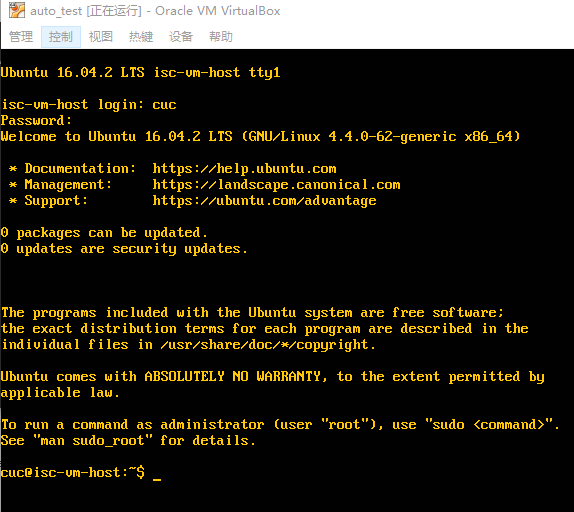

## 实验问题

### Problem 1 使用sftp在虚拟机和宿主机之间传输文件

由于虚拟机无法与宿主机共享粘贴板，使用PuTTY进行ssh远程连接。 使用host-only模式需要开启第二块网卡 enp0s8 。

	ifconfig enp0s8 up

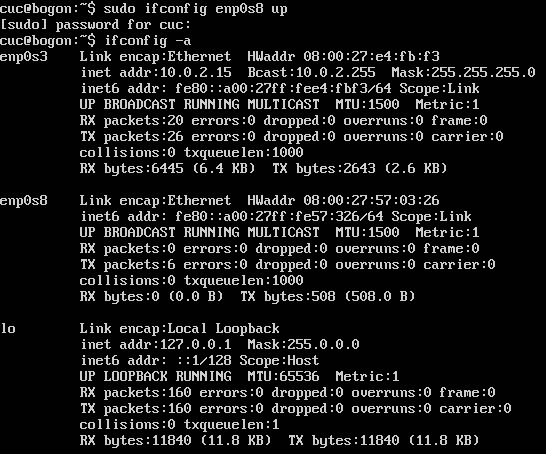

	# 为enp0s8分配地址
	dhclient enp0s8

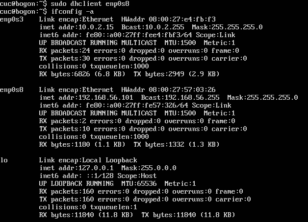

PuTTY连接失败，尝试在虚拟机ubuntu安装openssh-server

    apt-get install openssh-server

主机和宿主机仍然无法连接。

解决方法：修改全局变量，令主机虚机界面网络IPv4地址与DHCP服务器地址处于相同网段，即192.168.56.0/24。

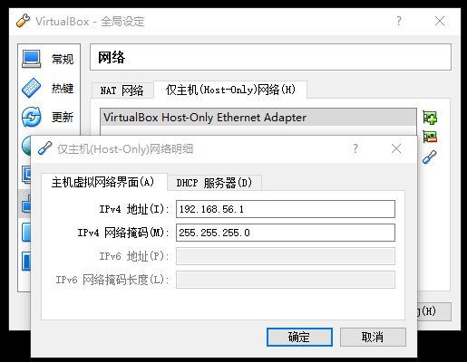

根据enp0s8获得的IPv4地址，PuTTY配置如图：  

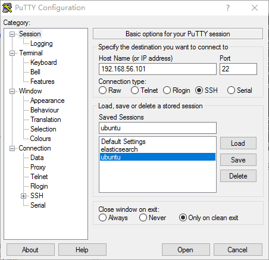

启动连接： 

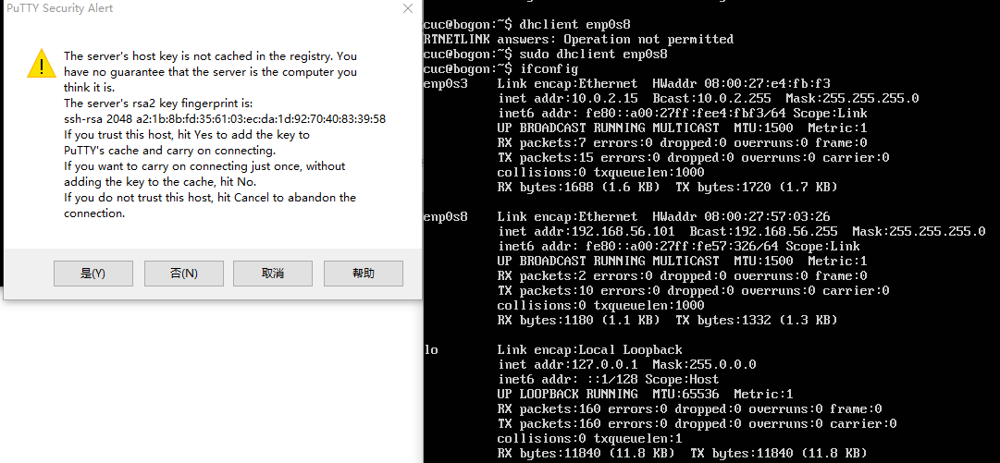

### Problem 2 对比ubuntu-server-autoinstall.seed和官方示例文件

ubuntu-server-autoinstall.seed 增添了如下设置：  
	
	# 指定语言和国家		      
	d-i localechooser/supported-locales multiselect en_US.UTF-8
	# 禁用自动（交互式）键映射检测
	d-i console-setup/ask_detect boolean false     
	# 禁止安装语言支持 	                     
	d-i pkgsel/install-language-support boolean false
	
	# 静态网络设置
	# 设置链路检测/dhcp的超时时间  
	d-i netcfg/link_wait_timeout string 5
	d-i netcfg/dhcp_timeout string 5

	d-i netcfg/get_ipaddress string 192.168.138.42
	d-i netcfg/get_netmask string 255.255.255.0			
	d-i netcfg/get_gateway string 192.168.138.1		      
	d-i netcfg/get_nameservers string 192.168.138.1	
	d-i netcfg/confirm_static boolean true
	
	# 设置主机名和域名
	# 但是从dhcp分配的任何主机名和域名优先于此处设置的值
	d-i netcfg/get_hostname string svr.sec.cuc.edu.cn
	d-i netcfg/get_domain string dns.sec.cuc.edu.cn
	# 强制使用以下主机名
	d-i netcfg/hostname string isc-vm-host

	# 创建用户账号
	d-i passwd/user-fullname string cuc
	d-i passwd/username string cuc
	d-i passwd/user-password password sec.cuc.edu.cn
	d-i passwd/user-password-again password sec.cuc.edu.cn
	
	# 设置时区为上海，且不在安装中获取时间
	d-i time/zone string Asia/Shanghai
	
	# 磁盘分区：如果磁盘上有空闲空间，可以直把全部空间分为一个分区
	d-i partman-auto/init_automatically_partition select biggest_free
	# 使用最大分区
	d-i partman-auto-lvm/guided_size string max
	# 多种分区策略
	d-i partman-auto/choose_recipe select multi
	# 不允许使用网络镜像
	d-i apt-setup/use_mirror boolean false
	# 安装openssh-server
	d-i pkgsel/include string openssh-server

	# debootstrap之后，软件包不启动更新
	d-i pkgsel/upgrade select none

	# 无人值守更新（自动进行安全更新）
	d-i pkgsel/update-policy select unattended-upgrades

* [B.4. Contents of the preconfiguration file (for xenial)](https://help.ubuntu.com/lts/installation-guide/armhf/apbs04.html)

### Problem 3 设置安装默认选项

编辑Ubuntu安装引导界面增加一个新菜单项入口。 

第一次保留第一行的 default install 。安装的时候，选择菜单项的页面出现Auto Install Ubuntu Server选项，执行label install的设置。

第二次改正为default autoinstall，就能实现无人值守的安装过程了。

### Problem 4 Virtualbox安装完Ubuntu之后，新添加的网卡实现系统开机自动启用和自动获取IP

按照上述方法修改全局设定以后，配置/etc/network/interfaces文件如图所示：  

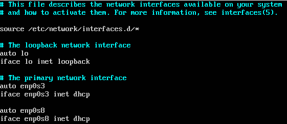

重启之后，网卡enp0s8会自动启用并获取IP。

### Problem 5 server版的ubuntu安装Virtualbox增强功能套件

You don't insert Guest Additions CD image you don't need to at all.   
open up a terminal and run this command to open up additional drivers.  
	
	sudo /usr/bin/software-properties-gtk --open-tab=4

Click on Using x86 visualization solution  

Then click on apply Changes  

在CLI中，上述方法无法实现图形界面的交互。因此选择从命令行安装增强功能套件。

If you wanted to Install this in terminal you would need to run this command.  

	sudo apt-get install virtualbox-guest-dkms 

安装完增强功能以后就可以点击“设备”，共享文件夹。

* [Installing Vbox Guest Additions in Ubuntu Server](http://askubuntu.com/questions/696377/installing-vbox-guest-additions-in-ubuntu-server)

### Problem 6 server版的ubuntu从命令行挂载Virtualbox的共享目录

	mkdir /mnt/shared
	mount -t vboxsf Linux_share /mnt/shared

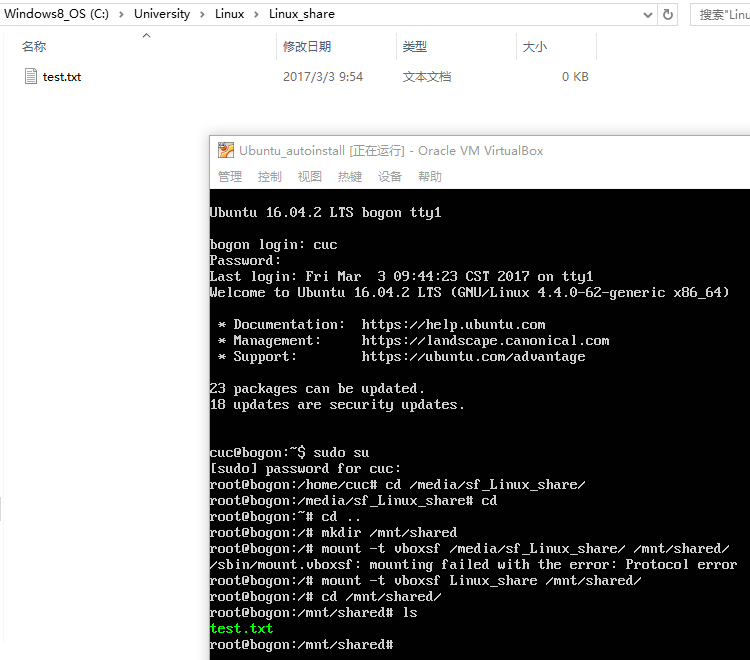

卸载命令：

	sudo umount -f /mnt/shared

* [Virtualbox虚拟机Ubuntu共享文件夹设置 自动挂载](http://blog.csdn.net/taochangchang/article/details/12918537)

虽然上述方法可以使远程共享通过/mnt/shared目录使用，但是只能以root身份执行mount命令。  如果是对于普通用户，就无法在这样挂载的目录中写入数据。  

* [第12章 使用Samba或NFS实现文件共享](http://www.linuxprobe.com/chapter-12.html)

### Problem 7 ssh 免密登录

1. Load session, 在Data->Auto-Login username写入远程主机的用户名。
2. 用PUTGEN.EXE在Windows本地主机生成公私钥对。key passphrase处填写ubuntu远程主机的登录口令。
3. 在PUTTY.EXE的SSH->Auth->Private key file for authentication添加私钥。
4. 用psftp将公钥传输到远程主机~/.ssh/authorized_keys。
5. Save session。 

实现免密登陆：

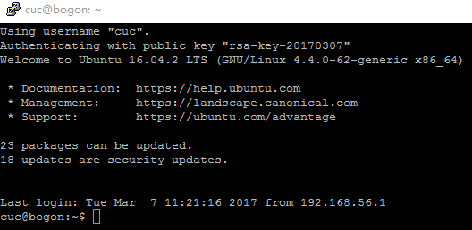
