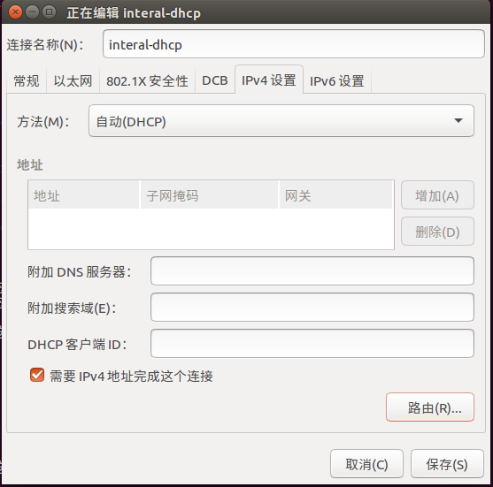
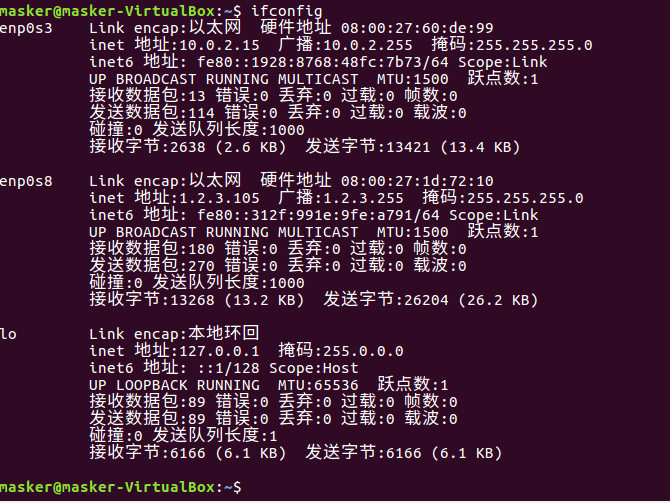
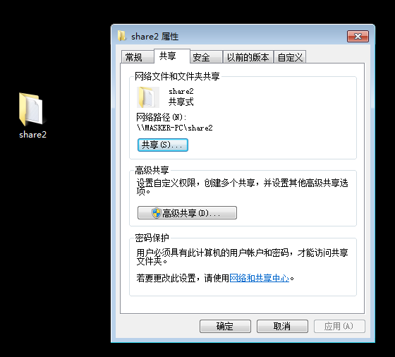
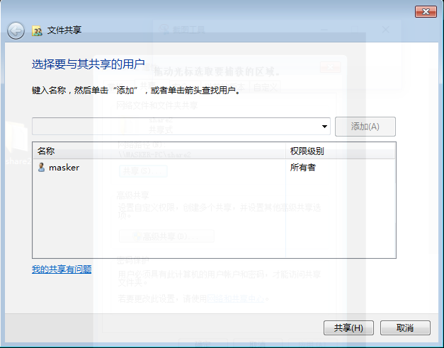
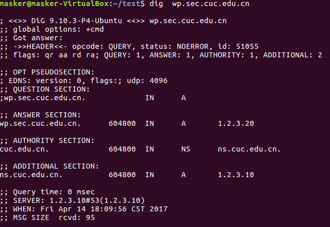
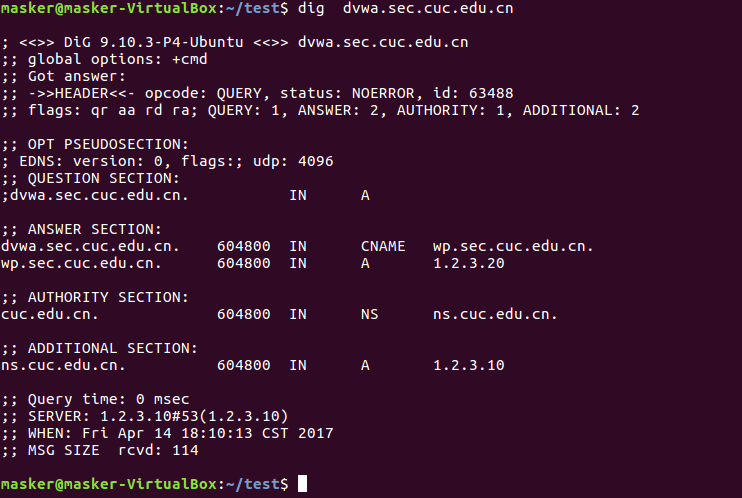

# FTP
    [ ] 配置一个提供匿名访问的FTP服务器，匿名访问者可以访问1个目录且仅拥有该目录及其所有子目录的只读访问权限；
    [ ] 配置一个支持用户名和密码方式访问的账号，该账号继承匿名访问者所有权限，且拥有对另1个独立目录及其子目录完整读写（包括创建目录、修改文件、删除文件等）权限；
        该账号仅可用于FTP服务访问，不能用于系统shell登录；

    [ ] FTP用户不能越权访问指定目录之外的任意其他目录和文件；
    [ ] 匿名访问权限仅限白名单IP来源用户访问，禁止白名单IP以外的访问；
    [ ] （可选加分任务）使用FTPS服务代替FTP服务，上述所有要求在FTPS服务中同时得到满足；
* 配置选项
	* 安装

			$sudo apt install vsftpd
	* vsftpd.conf(c+)

	        anonymous_enable=YES #允许匿名访问
   		    local_enable=YES  #允许使用用户名密码访问
	        write_enable=YES  #对于用户名密码访问的用户可写
			chroot_local_user=YES  #禁止访问当前根目录之外的目录
		
			#确定用户访问的根目录
			user_sub_token=$USER
			local_root=/home/$USER/ftp
			
			#规定访问使用端口范围
			pasv_min_port=40000
			pasv_max_port=50000

			#规定用户使用范围（匿名+vsftpd.userlist中的用户）
			userlist_enable=YES
			userlist_file=/etc/vsftpd.userlist
			userlist_deny=NO
			
			#对来访IP进行访问控制（需要配置hosts.allow+hosts.deny）
    	    tcp_wrappers=YES
	* hosts.allow(+)
			
			vsftpd:1.2.3.20
	* hosts.deny(+)

			vsftpd:ALL

	* shells(+)

			/usr/sbin/nologin
	* 命令使用
	
			#初始化ftp用户路径
			$sudo useradd [username] #添加用户
			$sudo passwd [username]
		    $sudo mkdir /home/[username]/ftp #创建文件夹
		    $sudo chown nobody:nogroup /home/[username]/ftp #修改属主
		    $sudo chmod a-w /home/[username]/ftp #修改权限

			#添加测试文件
			$sudo mkdir /home/[username]/ftp/files
    		$sudo chown sammy:sammy /home/[username]/ftp/files
			$echo "vsftpd test file" | sudo tee /home/[username]/ftp/files/test.txt

			#禁止用户使用shell登录
			$usermod -s /usr/sbin/nologin [username]

# NFS

    [ ] 在1台Linux上配置NFS服务，另1台电脑上配置NFS客户端挂载2个权限不同的共享目录，分别对应只读访问和读写访问权限；
    [ ] 实验报告中请记录你在NFS客户端上看到的：
        共享目录中文件、子目录的属主、权限信息
        你通过NFS客户端在NFS共享目录中新建的目录、创建的文件的属主、权限信息
        上述共享目录中文件、子目录的属主、权限信息和在NFS服务器端上查看到的信息一样吗？无论是否一致，请给出你查到的资料是如何讲解NFS目录中的属主和属主组信息应该如何正确解读
	[ ] （可选加分任务）在客户端或NFS服务器上抓包分析使用NFS协议时的远程文件下载、上传、移动、删除等操作是否是明文？远程的文件传输数据流是否可以被恢复出完整的传输文件？

    	提示：我们在《网络安全》第4章《网络监听》中介绍过的工具filesnarf

* 挂载信息

	

* client： readonly

	

* server： readonly
 
    

* client： rw

	

* server： rw

	

## DHCP
* DHCP Server
	* 安装DHCP Server

			$sudo apt install isc-dhcp-server
	* 更改网卡接口 /etc/default/isc-dhcp-server

			INTERFACES="enp0s9"
	* /etc/dhcp/dhcpd.conf
			ddns-update-style none;
			
			option domain-name "example.org";
			option domain-name-servers ns1.example.org, ns2.example.org;
			
			default-lease-time 600;
			max-lease-time 7200;
		
			log-facility local7;

			subnet 1.2.3.0 netmask 255.255.255.0 {
			 range 1.2.3.100 1.2.3.200; #Range
			 option broadcast-address 1.2.3.255; #Broadcast
			}
	*  重启DHCP Server

			$sudo systemctl restart isc-dhcp-server.service
* DHCP Client
	* 设置DHCP服务

		
	* 查看分配地址
	
		 	

## Samba
* Linux Server（Interal : 1.2.3.10）
	* 安装Samba服务器
	
			$sudo apt-get install samba
	* 创建Samba共享专用的用户
	
			$sudo useradd -M -s /usr/sbin/nologin demoUser
			$sudo passwd demoUser
	* 创建的用户必须有一个同名的Linux用户，密码是独立的
	
			$sudo smbpasswd -a demoUser
	* 创建用户组

			$sudo groupadd demoGroup
			$sudo usermod -G demoGroup demoUser
	* 在/etc/samba/smb.conf 文件尾部追加以下“共享目录”配置
		
			[demo]
	        	path = /srv/samba/demo/
	        	read only = no
	        	guest ok = no
	      	    force create mode = 0660
	        	force directory mode = 2770
	        	force user = demoUser
	        	force group = demoGroup
		 Forced Parameters 可以强制所有连接共享目录的用户创建的文件、目录使用特定的权限位设定、属主用户和属主组（有安全风险）
* Windows Server（Interal : 1.2.3.101）
	* 首先保证server与client网络联通
	* 使用windows共享文件夹，并进行配置
		* 网络路径为\\MASKER-PC\share2
		* 共享用户为masker

		

		
* Linux Client（Interal ： 1.2.3.20）
	* 安装samba客户端
	
			$sudo apt-get install smbclient
	* 指定用户(masker)与共享目录(/share2)连接到windows

			#使用ip连接
			$sudo smbclient //1.2.3.101/share2 -U masker
			#使用主机名连接
			$sudo smbclient //MASKER-PC/share2 -U masker
		

		
	* 使用ls查看该目录下文件
		
		
	* 下载整个目录
			
			\>tarmode
			\>recurse
			\>prompt
			\>mget folder\
		
	* 查看下载的目录
		
		

## DNS
* DNS Server
	* 安装bind9和工具集

			$sudo apt install bind9
			$sudo apt install dnsutils
	* /etc/bind/named.conf.options

			options {
		        directory "/var/cache/bind";
		
		         forwarders {
		                1.2.3.100; #Client ip
		         };

		        dnssec-validation auto;
		
		        auth-nxdomain no;    # conform to RFC1035
		        listen-on-v6 { any; 
				};
	
	* /etc/bind/named.conf.local
			
			zone "cuc.edu.cn" {
			        type master;
			        file "/etc/bind/db.cuc.edu.cn";
			};
	* 创建保存域名解析的db文件

			$sudo cp /etc/bind/db.local /etc/bind/db.cuc.edu.cn

	* /etc/bind/db.cuc.edu.cn

			;
			; BIND data file for local loopback interface
			;
			$TTL    604800
			@       IN      SOA     cuc.edu.cn. root.cuc.edu.cn. (
			                              2         ; Serial
			                         604800         ; Refresh
			                          86400         ; Retry
			                        2419200         ; Expire
			                         604800 )       ; Negative Cache TTL
			;
			; name servers - NS records
			     IN      NS      ns.cuc.edu.cn.
			ns      IN      A       1.2.3.10
			;
			; wp - A records
			wp.sec.cuc.edu.cn.      IN      A       1.2.3.20
			;
			; DVWA - CNAME records
			dvwa.sec.cuc.edu.cn.    IN      CNAME   wp.sec.cuc.edu.cn.
	* 重启DNS服务器

			$sudo systemctl restart bind9.service

* DNS Client
	* 增添DNS服务器
	
			$sudo vim /etc/resolvconf/resolv.conf.d/head
	* /etc/resolvconf/resolv.conf.d/head

			# Dynamic resolv.conf(5) file for glibc resolver(3) generated by resolvconf(8)
			#     DO NOT EDIT THIS FILE BY HAND -- YOUR CHANGES WILL BE OVERWRITTEN
				search host.cuc.edu.cn  # your private domain
				nameserver 1.2.3.10  # ns private IP address
	* 生成新的resolv.conf文件
		
			$sudo resolvconf -u
	* 查看 resolv.conf

			# Dynamic resolv.conf(5) file for glibc resolver(3) generated by resolvconf(8)
			#     DO NOT EDIT THIS FILE BY HAND -- YOUR CHANGES WILL BE OVERWRITTEN
			search host.cuc.edu.cn  # your private domain
			nameserver 1.2.3.10  # ns private IP address
			nameserver 127.0.1.1
			search example.org
* 测试
	* $dig wp.sec.cuc.edu.cn
		
	* $dig dvwa.sec.cuc.edu.cn
		

