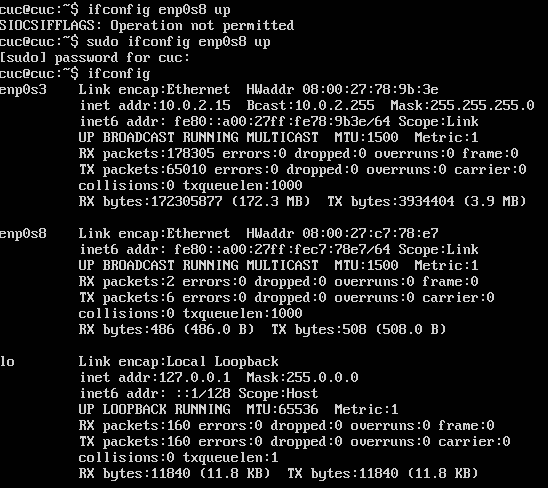
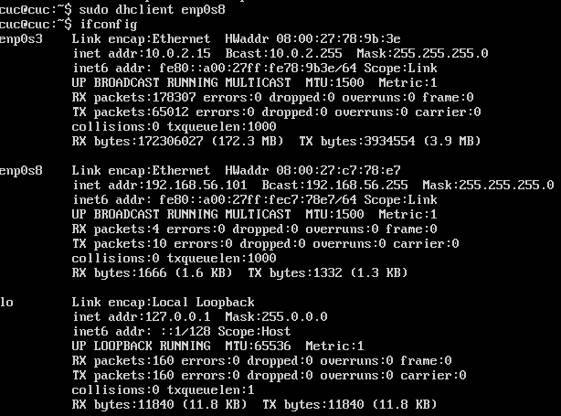
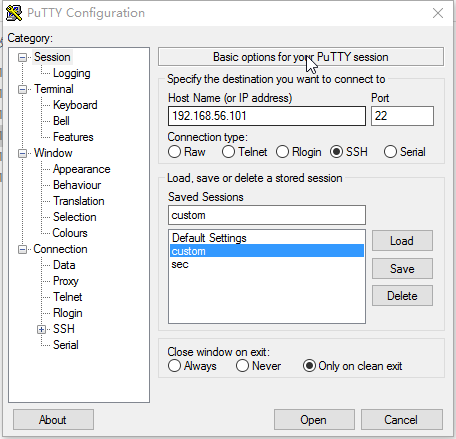
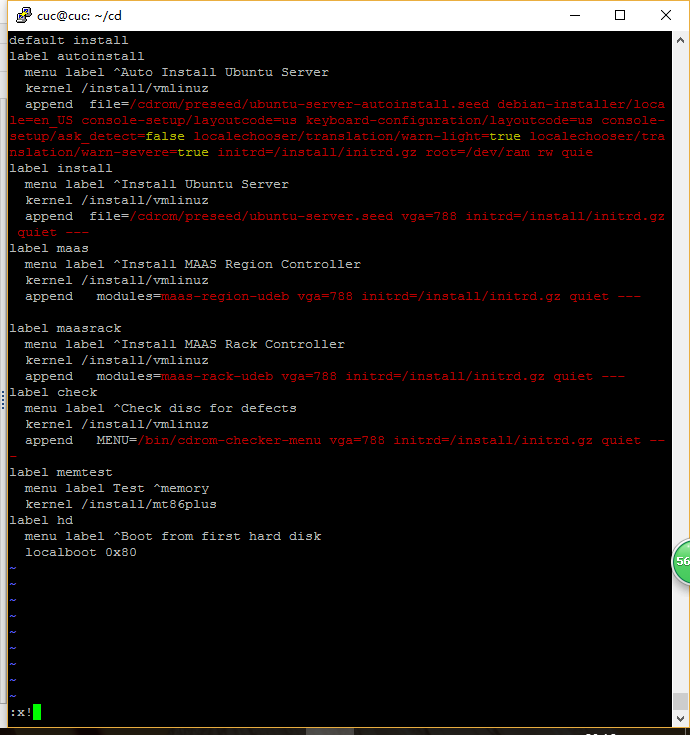
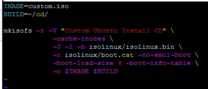
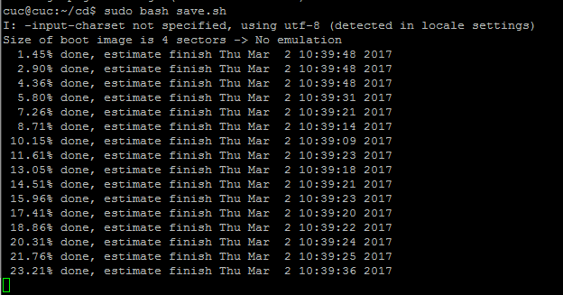
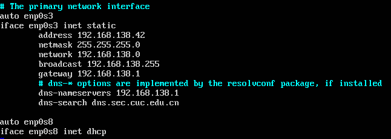
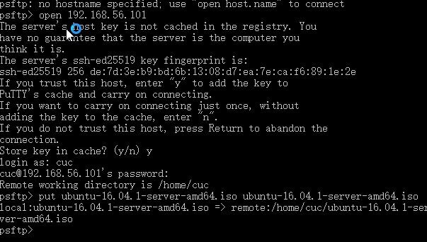

# 无人值守Linux安装镜像制作  
## 一、实验环境：Ubuntu 16.04 Server 64bit  
## 二、实验过程：  
1. 需要开启两块网卡：网络地址转换（NAT）和Host-only  
2. 用ifconfig -a查看网络接口配置信息，开启Host-only网卡并开启dhcp  
	  
3. 开启ssh服务  
	> sudo apt-get install openssh-server  
	> sudo service ssh open  
4. 使用putty远程登录，使用psftp传输文件
	  
5. 在当前用户目录下创建一个用于挂载iso镜像文件的目录  
	> mkdir loopdir  
6. 挂载iso镜像文件到该目录  
	> sudo mount -o loop ubuntu-16.04.1-server-amd64.iso loopdir  
7. 创建一个工作目录用于克隆光盘内容  
	> mkdir cd  
8. 同步光盘内容到目标工作目录,一定要注意loopdir后的这个/，cd后面不能有/  
	> sudo rsync -av loopdir/ cd  
9. 卸载iso镜像  
	> sudo umount loopdir  
10. 进入目标工作目录  
	> cd cd/  
11. 编辑Ubuntu安装引导界面增加一个新菜单项入口,强制保存:x!    
	> sudo vim isolinux/txt.cfg  

12. 将ubuntu-server-autoinstall.seed通过psftp传输到虚拟机，并保存到刚才创建的工作目录~/cd/preseed/ubuntu-server-autoinstall.seed   
13. 修改isolinux/isolinux.cfg，增加内容timeout 10，并重新生成md5sum.txt    
  
	sudo chmod 777 md5sum.txt  
	sudo find . -type f -print0 | xargs -0 md5sum > md5sum.txt  
14. 把脚本保存成bash文件save.sh  
   
15. 封闭改动后的目录到.iso  
	sudo apt-get insatll mkisofs  
	sudo bash save.sh  

## 三、实验问题及解决方法
* Virtualbox安装完Ubuntu之后新添加的网卡如何实现系统开机自动启用和自动获取IP  
	* 修改/etc/network/interfaces文件
	  
	* 参考链接：https://www.cnblogs.com/yudar/p/4446975.html  
* 如何使用sftp在虚拟机和宿主机之间传输文件  
	* 使用psftp传输文件
		  
	* 使用共享文件夹：安装VirtualBox增强功能，挂载虚拟文件夹
		* $sudo mount -t vboxsf xxx /mnt
		* 参考链接：http://jingyan.baidu.com/article/b2c186c8ffb607c46ff6ff61.html  
## 四、对比ubuntu-server-autoinstall.seed与官方示例文件  

1. 指定多个语言环境  
2. 跳过语言选择器设置  
*** 
  
1. 设置链路检测超时为5s  
2. DHCP服务超时和安装程序超时设置为5s  
3. 设置为手动配置网络  
*** 
  
1. 静态网络配置（默认网卡的IP、掩码、默认网关等）  
***  
  
1. 设置主机名和域名,从dhcp分配的任何主机名和域名优先于此处设置的值  
2. 无论DHCP服务器返回什么或IP的反向DNS条目是什么,都强制使用主机名isc-vm-host  
***  
  
1. 创建正常用户帐户:cuc  
2. 密码为：sec.cuc.edu.cn  
*** 
  
1. 设置时区为亚洲/上海  
2. 控制是否在安装期间使用NTP来设置时钟，设置为否  
***  
  
1. 如果系统有可用空间，您可以选择仅分区该空间。这仅在未设置partman-auto / method（如下）时才会生效。替代：custom，some_device，some_device_crypto，some_device_lvm  
*** 
  
1. 对于LVM分区，设置逻辑卷的卷组的大小为最大。  
2. 选择预定义的分区方法(共三种)：multi  
3. multi：分成/home，/var和/tmp三个分区  
***

1. 设置不使用网络镜像  
***

1. 软件包平台server  
2. 自定义安装的附加软件包openssh-server  
3. 设置软件包不自动升级  
*** 

1. 应用更新的策略：可能是“无”（无自动更新），“无人值守升级”（自动安装安全更新）或“横向”（使用Landscape管理系统）  
2. 此处设置为“无人值守升级”  

## 五、问题及注意
1. 编辑Ubuntu安装引导界面增加一个新菜单项入口时，要加在isolinux/txt.cfg在开头，我的猜想是该文件按照有从前到后的执行优先顺序  
2. md5sum.txt即使用sudo也无法直接修改，要用chmod提权才能修改  
3. 执行封闭改动后的目录到.iso的脚本时，先把脚本保存到一个bash文件，再用sudo bash x.sh来运行脚本  
